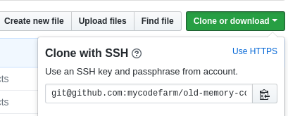

# 一台电脑如何配置多个github账户
有一个github账户时很简单,不管采用ssh还是https方式提交都没问题,但多个账户时最好采用ssh.

现在的情况是:以前只有一个账户,全部都采用https的方式,现在多了一个账户,该怎么办?

下面是我的做法,是通用的.

## 如何区别使用的哪种方式
很简单,2种方法
1. 在github界面查看:当初是怎样克隆的就是哪种方式.

2. 命令查看:
    1. ssh
    ```shell
    $ git config --list
    ...
    remote.origin.url=git@github.com:jimolonely/myshell.git
    ```
    2. https
    ```shell
    $ git config --list
    ...
    remote.origin.url=https://github.com/jimolonely/myshell.git
    ```

## 如何使用ssh方式
这个就很容易了.分为6步.

1. 去掉以前的key cache,可有可无,因为可能有其他的ssh key
```shell
$ ssh-add -D # 删除所有 
$ ssh-add -l 
```
2. 生成key
```shell
[jimo@jimo-pc .ssh]$ ssh-keygen -t rsa -C "xxx@foxmail.com"
Generating public/private rsa key pair.
Enter file in which to save the key (/home/jimo/.ssh/id_rsa): /home/jimo/.ssh/id_rsa_jimo
Enter passphrase (empty for no passphrase): 
Enter same passphrase again: 
Your identification has been saved in /home/jimo/.ssh/id_rsa_jimo.
Your public key has been saved in /home/jimo/.ssh/id_rsa_jimo.pub.
The key fingerprint is:
SHA256:a95OgBQ9DBkNw4RM8NKi/NXbbQmJyjHYiwk2UaO+i7k wp147188@foxmail.com
The key's randomart image is:
+---[RSA 2048]----+
|  .*.+BO         |
|  oo+ oo=        |
| oo o .  .       |
|o..oo.... .      |
|.* . =.oSo       |
|. = = = ooo .    |
| . + + .o..+     |
|...    o o.      |
|Eo      ..o      |
+----[SHA256]-----+

同理生成另外一个.
```

3. 添加到ssh
```shell
[jimo@jimo-pc .ssh]$ ssh-add id_rsa_code
Identity added: id_rsa_code (id_rsa_code)

[jimo@jimo-pc .ssh]$ ssh-add id_rsa_jimo
Identity added: id_rsa_jimo (id_rsa_jimo)

[jimo@jimo-pc .ssh]$ ssh-add -l
2048 SHA256:UtdQCo1Ca7Gf4ITAsyxxXpjaLXan28CAv1O2QBylWTc id_rsa_code (RSA)
2048 SHA256:a95OgBQ9DBkNw4RM8NKi/NXbbQmJyjHYiwk2UaO+i7k id_rsa_jimo (RSA)
```
4. 将公钥(id_rsa_code.pub里的)复制到[github账户ssh里](https://github.com/settings/keys)
5. 测试:
```shell
[jimo@jimo-pc .ssh]$ ssh -T github.com
Hi jimolonely! You've successfully authenticated, but GitHub does not provide shell access.

[jimo@jimo-pc .ssh]$ ssh -T github-code
Hi mycodefarm! You've successfully authenticated, but GitHub does not provide shell access.
```
6. 配置,在~/.ssh/config下配置:
```shell
[jimo@jimo-pc .ssh]$ cat config 
# Default github account
Host github.com
 HostName github.com
 User git
 IdentityFile /home/jimo/.ssh/id_rsa_jimo

 # second account
Host github-code
 HostName github.com
 User git
 IdentityFile /home/jimo/.ssh/id_rsa_code
```
## 如何使用很关键
到这里,克隆或则添加origin的时候需要注意,使用config里自己定义的Host.

比如: 创建了一个新账户,叫test,本来克隆该用
```
git clone git@github.com:mycodefarm/test.git
```
但现在需要使用github-code替代 github.com
```
git clone git@github-code:mycodefarm/test.git
```
另外遇到:
```
[jimo@jimo-pc test]$ git commit -m 'first'

*** 请告诉我你是谁。

运行

  git config --global user.email "you@example.com"
  git config --global user.name "Your Name"

来设置您账号的缺省身份标识。
如果仅在本仓库设置身份标识，则省略 --global 参数。
```
需要在每个项目单独配置用户名和邮箱,但首先删除全局配置:
```
$ git config --global --unset user.name

[jimo@jimo-pc test]$ git config user.name "mycodefarm" && git config user.email "xx@xx.com"
```

## 结果
现在可以混用https和ssh提交了.

但最好全部改为ssh,因为如果使用了credential.helper store,会把密码存储在~/.git-credentials下,不太好.


