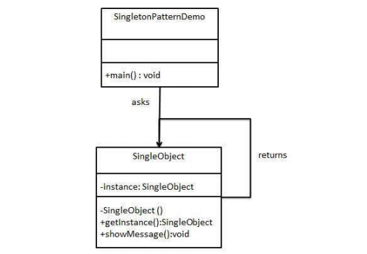

# Singleton Pattern



## 1.
```java
public class SingleObject {
    private static SingleObject instance = new SingleObject();

    private SingleObject() {
    }

    public static SingleObject getInstance() {
        return instance;
    }

    public void showMessage() {
        System.out.println("message");
    }
}
```
## 2.
```java
public class SingletonPatternDemo {
    public static void main(String[] args) {
        SingleObject obj = SingleObject.getInstance();
        obj.showMessage();
    }
}
```