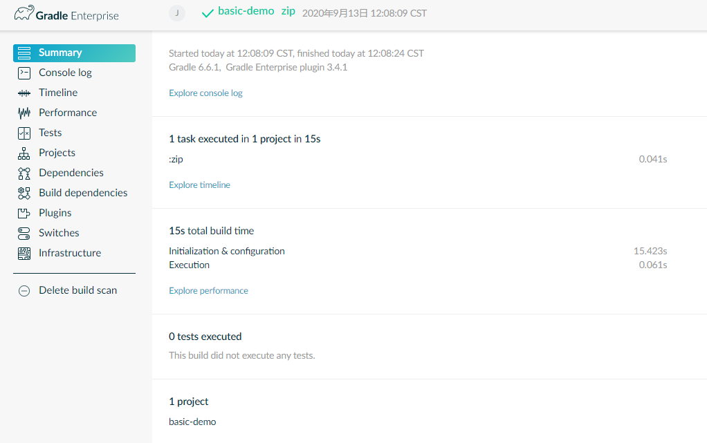

# hello world

gradle的hello world也是很简单的。

# 初始化项目

```shell script
gradle-demo\basic-demo>gradle init
Starting a Gradle Daemon (subsequent builds will be faster)

Select type of project to generate:
  1: basic
  2: application
  3: library
  4: Gradle plugin
Enter selection (default: basic) [1..4]

Select build script DSL:
  1: Groovy
  2: Kotlin
Enter selection (default: Groovy) [1..2] 2

Project name (default: basic-demo):

> Task :init
Get more help with your project: https://guides.gradle.org/creating-new-gradle-builds

BUILD SUCCESSFUL in 47s
2 actionable tasks: 2 executed
```

# 弄清楚这些脚本的作用

```shell script
├── build.gradle.kts   # 配置当前项目的构建脚本
├── gradle
│   └── wrapper
│       ├── gradle-wrapper.jar   # 可执行gradle wrapper JAR
│       └── gradle-wrapper.properties  
├── gradlew        # Unix系统构建脚本
├── gradlew.bat    # windows系统构建脚本
└── settings.gradle.kts   # gradle的配置脚本，对构建的配置，相当于元构建
```

为了避免每次构建时都去下载gradle的包，我们使用本地的：

```shell
basic-demo> .\gradlew copy
Downloading https://services.gradle.org/distributions/gradle-6.6.1-bin.zip
.......
```

修改 `gradle/wrapper/gradle-wrapper.properties`

```
#distributionUrl=https\://services.gradle.org/distributions/gradle-6.6.1-bin.zip
distributionUrl=file:///D:/software/gradle-6.6.1-bin.zip
```

# 创建一个task

在 build.gradle.kts脚本里：

```kotlin
tasks.create<Copy>("copy") {
    description = "copy src to dest dir"
    group = "Custom"

    from("src")
    into("dest")
}
```
然后构建copy这个任务: 会发现dest目录被自动创建，并和src文件内容一致.

```shell script
basic-demo> .\gradlew copy

BUILD SUCCESSFUL in 14s
1 actionable task: 1 executed
```

# 创建一个打包任务

需要引入一个插件
```kotlin
plugins {
    id("base")
}

tasks.create<Zip>("zip") {
    description = "archive source to a zip file"
    group = "Archive"

    from("src")
    archiveFileName.set("basic-demo.zip")
}
```
构建：
```shell script
basic-demo> .\gradlew zip

BUILD SUCCESSFUL in 5s
1 actionable task: 1 executed
```

# 发现可用的任务

```shell script
basic-demo> .\gradlew tasks

> Task :tasks

------------------------------------------------------------
Tasks runnable from root project
------------------------------------------------------------

Archive tasks
-------------
zip - archive source to a zip file

Build tasks
-----------
assemble - Assembles the outputs of this project.
build - Assembles and tests this project.
clean - Deletes the build directory.

Build Setup tasks
-----------------
init - Initializes a new Gradle build.
wrapper - Generates Gradle wrapper files.

Custom tasks
------------
copy - copy src to dest dir

Help tasks
----------
buildEnvironment - Displays all buildscript dependencies declared in root project 'basic-demo'.
components - Displays the components produced by root project 'basic-demo'. [incubating]
dependencies - Displays all dependencies declared in root project 'basic-demo'.
dependencyInsight - Displays the insight into a specific dependency in root project 'basic-demo'.
dependentComponents - Displays the dependent components of components in root project 'basic-demo'. [incubating]
help - Displays a help message.
kotlinDslAccessorsReport - Prints the Kotlin code for accessing the currently available project extensions and conventions.
model - Displays the configuration model of root project 'basic-demo'. [incubating]
outgoingVariants - Displays the outgoing variants of root project 'basic-demo'.
projects - Displays the sub-projects of root project 'basic-demo'.
properties - Displays the properties of root project 'basic-demo'.
tasks - Displays the tasks runnable from root project 'basic-demo'.

Verification tasks
------------------
check - Runs all checks.

Rules
-----
Pattern: clean<TaskName>: Cleans the output files of a task.
Pattern: build<ConfigurationName>: Assembles the artifacts of a configuration.
Pattern: upload<ConfigurationName>: Assembles and uploads the artifacts belonging to a configuration.

To see all tasks and more detail, run gradlew tasks --all

To see more detail about a task, run gradlew help --task <task>

BUILD SUCCESSFUL in 2s
1 actionable task: 1 executed
```

# 分析构建过程

如果执行下面的扫描：
```shell script
basic-demo> .\gradlew zip --scan

BUILD SUCCESSFUL in 15s
1 actionable task: 1 executed

Publishing a build scan to scans.gradle.com requires accepting the Gradle Terms of Service defined at https://gradle.com/terms-of-service. Do you accept these terms? [yes, no] yes

Gradle Terms of Service accepted.

Publishing build scan...
https://gradle.com/s/obizsmicreidfdf2
```

会生成一个连接: `https://gradle.com/s/obizsmicreidfdf2`, 如果邮件激活了，会看到整个分析过程，**不过也会把个人电脑的情况发送到gradle的服务器，安全第一，还是自己打一个服务吧**。



# 发现可用的配置

```shell script
basic-demo> .\gradlew properties

> Task :properties

------------------------------------------------------------
Root project
------------------------------------------------------------

allprojects: [root project 'basic-demo']
ant: org.gradle.api.internal.project.DefaultAntBuilder@3a03af6
antBuilderFactory: org.gradle.api.internal.project.DefaultAntBuilderFactory@2e4198a1
archivesBaseName: basic-demo
artifacts: org.gradle.api.internal.artifacts.dsl.DefaultArtifactHandler_Decorated@afb4061
asDynamicObject: DynamicObject for root project 'basic-demo'
baseClassLoaderScope: org.gradle.api.internal.initialization.DefaultClassLoaderScope@32453b5b
buildDir: D:\workspace\codes\gradle-demo\basic-demo\build
buildFile: D:\workspace\codes\gradle-demo\basic-demo\build.gradle.kts
...
```


