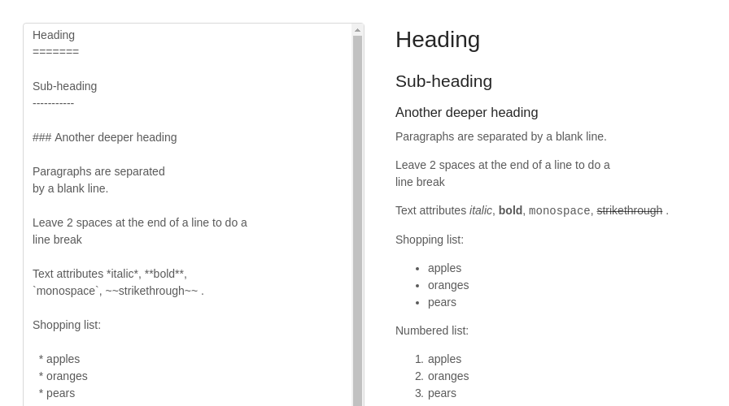

## 创建项目
```shell
$ create-react-app my-markdown
```
导入必备的库

使用antdesign样式库:
```shell
$ yarn add antd
```
高级配置: 按需导入样式,配置按照官方文档:[https://ant.design/docs/react/use-with-create-react-app-cn](https://ant.design/docs/react/use-with-create-react-app-cn)

为了解析markdown语法,我们使用[markd](https://github.com/chjj/marked)
```shell
$ yarn add markd
```
## 实现
最终样式:



1. 先布局(使用栅格布局和输入框即可)
2. 添加事件

由于很简单,直接贴出全部代码.
```javascript
import React from 'react';
import { Row, Col, Input } from 'antd';
import './App.css';

const { TextArea } = Input;
const marked = require('marked');
marked.setOptions({
  renderer: new marked.Renderer(),
  gfm: true,
  tables: true,
  breaks: false,
  pedantic: false,
  sanitize: false,
  smartLists: true,
  smartypants: false
});

class App extends React.Component {

  constructor(props) {
    super(props);
    this.state = {
      value: "",
      markdText: ""
    };
    this.handleChange = this.handleChange.bind(this);
  }

  handleChange(e) {
    this.setState({
      value: e.target.value,
      markdText: marked(e.target.value)
    });
  }

  render() {
    return (
      <div className="App">
        <Row>
          <Col span={11}>
            <TextArea placeholder="input markdown text"
              value={this.state.value}
              onChange={this.handleChange}
              autosize={{ minRows: 20, maxRows: 30 }} />
          </Col>
          <Col span={1}></Col>
          <Col span={11}>
            <div dangerouslySetInnerHTML={{ __html: this.state.markdText }}>
            </div>
          </Col>
        </Row>
      </div>
    );
  }
}

export default App;
```
另外可以根据markd加一些库增加渲染样式.


